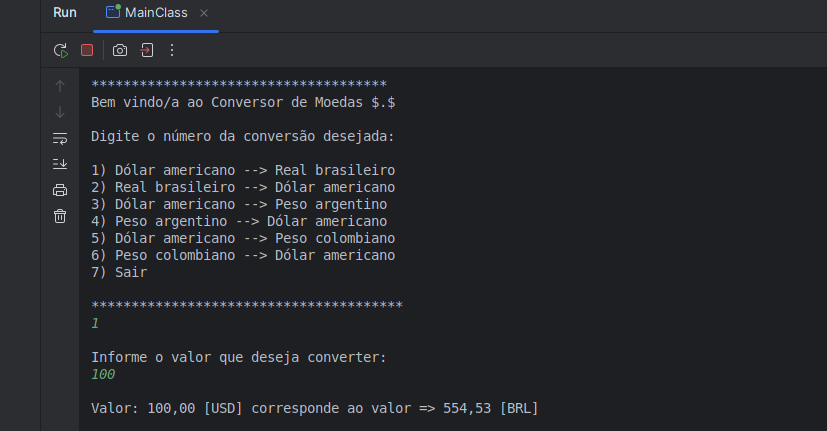

<div align="center">


# ONE - Oracle Next Education - Challenge Conversor de Moedas

  
  
  

</div>

### Descrição
Este é um projeto de conversor de moedas que utiliza a API da ExchangeRate-API para realizar a conversão de diferentes moedas. O projeto é desenvolvido em Java e permite ao usuário escolher entre algumas conversões pré-definidas, como de Dólar para Real, Real para Dólar, Dólar para Peso Argentino, entre outras.

### Funcionalidades
- Interação via console
- Integração com a ExchangeRate-API para obter a taxa de câmbio em tempo real
- Conversão de Dólar Americano (USD) para Real Brasileiro (BRL)
- Conversão de Real Brasileiro (BRL) para Dólar Americano (USD)
- Conversão de Dólar Americano (USD) para Peso Argentino (ARS)
- Conversão de Peso Argentino (ARS) para Dólar Americano (USD)
- Conversão de Dólar Americano (USD) para Peso Colombiano (COP)
- Conversão de Peso Colombiano (COP) para Dólar Americano (USD)

### Ferramentas/Tecnologias Usadas
- **Java 17:** Linguagem de programação utilizada para o desenvolvimento do projeto.
- **HttpClient:** Lib para realizar requisições HTTP.
- **Gson:** Lib usada para converter JSON em objetos Java.
- **ExchangeRate-API:** API externa utilizada para obter as taxas de conversão entre diferentes moedas.

### Pré-requisitos
- Java 16+
- Maven

### Como usar
- Clone o repositório:
```bash
git clone https://github.com/maxjdev/ConversorDeMoedas-OracleNextEducation-Challenge.git
```

- Acesse o site <a href="https://www.exchangerate-api.com">ExchangeRate</a> e cadastre seu e-mail para receber sua API_KEY

- Configurar API_KEY no pacote: *br.com.conversorDeMoedas.apis*:
```java
private final String API_KEY = "SUA_API_KEY_AQUI";
```

- Compile o projeto usando o terminal no diretório do projeto usando o comando:
```bash
mvn clean install
```

- Execute o projeto:
```bash
java -jar target/conversorDeMoedas.jar
```

- Ao iniciar o programa, um menu será exibido com as opções de conversão de moedas disponíveis.
- Selecione o número correspondente à conversão desejada.
- Insira o valor a ser convertido.
- O programa retornará o valor convertido para a moeda de destino.

#### Exemplo de uso

